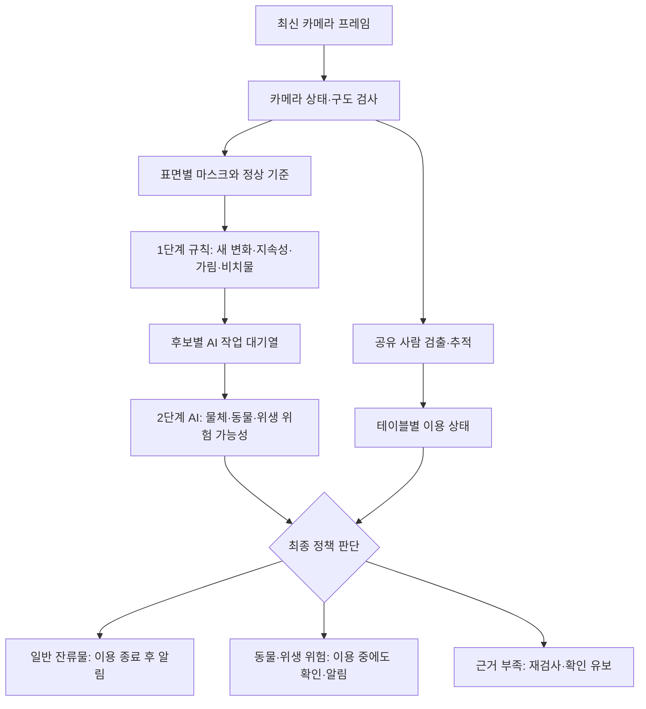
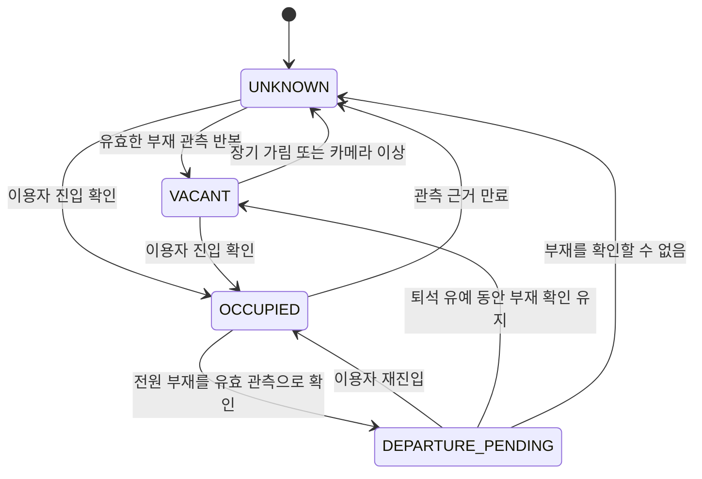
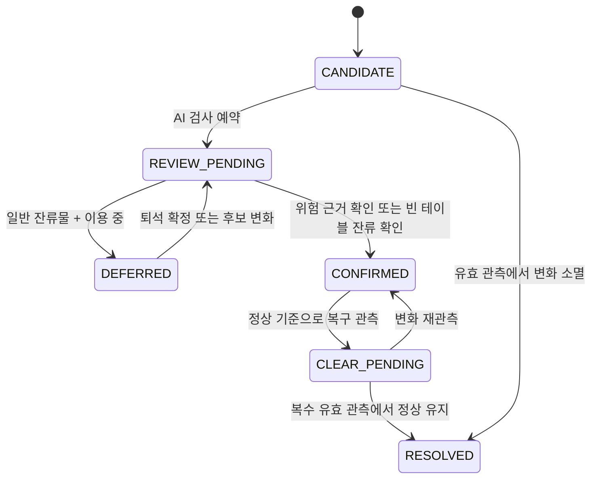
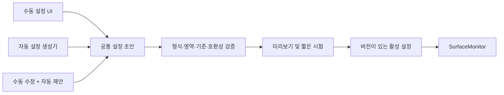

# 테이블 이용 상태 기반 청소·위생 감시 상세 설계

작성일: 2026-09-11 · 상태: 구현 전 설계안

## 1. 제품 동작 요약

> 손님이 테이블을 이용하는 동안 일반 컵·포장지·휴지는 기록만 한다. 이용자가 모두 떠난 뒤에도 남으면 청소 알림을 보낸다. 동물과 위생 위험 의심은 이용 중에도 별도 확인한다.

이 설계는 [표면별 오염 감지 설계](2026-09-11-surface-contamination-design.md)를 구체화한다. 바닥·벽은 표면 감시 공통 엔진을 사용하고, 테이블에만 이용 상태에 따른 일반 청소 알림 보류를 적용한다.

확정된 제품 정책:

- 표면·변화 후보·지속성·이용 상태는 최대한 규칙으로 처리한다.
- 후보의 물체 종류와 동물·위생 위험 가능성은 AI로 보완한다.
- 기본 비치물은 승인된 정상 배치에 포함한다.
- '사람 없음'은 해당 테이블의 이용자가 없다는 의미다.
- 가림·추적 실패·AI 미실행을 정상이나 퇴석으로 취급하지 않는다.
- 쓰레기와 개인 소지품을 확정 구분하기 어려우므로 일반 알림 명칭은 '청소·잔류물 확인 필요'로 한다.
- 위생 위험의 세부 종류(토사물·배설물 등)는 검증된 모델이 없으면 확정 표시하지 않는다.

## 2. 한눈에 보는 구조



사람 검출은 이용 상태를 파악하는 공통 인식 기능이므로 변화 후보가 없더라도 주기적으로 필요하다. '2단계'는 모든 AI를 끄는 구조가 아니라, 오염·잔류물 정밀 판정을 후보에 한정하는 구조다. 공유 객체 모델이 사람과 동물을 함께 검출하면 결과를 재사용한다.

## 3. 설치 설정: 테이블마다 세 영역 등록

| 영역 | 역할 | 포함하지 않을 것 |
|---|---|---|
| `surface_polygon` | 상판 변화 분석 | 테이블 다리·배경 바닥 |
| `usage_zones` | 좌석과 실제 테이블 이용자 연결 | 옆 통로 전체 |
| `fixture_regions` | 메뉴판·휴지 케이스 등 정상 비치물 | 비치물 주변 상판 전체 |

카메라 한 대에 테이블 ID를 고정 부여한다. 매번 YOLO 테이블 박스로 영역과 ID를 생성하지 않는다. 영역은 화면에서 그리는 다각형으로 저장하며 카메라 구도·해상도와 연결한다.

테이블 상판이 충분히 보이지 않으면 설치 화면에 감시 한계를 표시한다. 비치물 아래나 사람 뒤에 가려진 표면은 '관측 불가'이며 청결 판정 대상이 아니다.

### 정상 기준 등록

1. 청소하고 기본 비치물을 정상 위치에 놓는다.
2. 사람이 가리지 않는 여러 프레임으로 기준 영상을 생성한다.
3. 가능하면 비치물을 치운 빈 상판 기준도 별도로 확보한다.
4. 설치자가 확인한 뒤 기준 버전을 확정한다.

퇴석 직후 영상, 장시간 변화 없는 영상, 사람 없는 영상은 자동 정상 기준으로 승격하지 않는다. 청소 완료 이벤트도 기준 자동 덮어쓰기와 분리한다.

## 4. 이용 상태 판정

### 4.1. 사람을 테이블과 연결하는 규칙

- 서 있는 사람은 발 위치, 앉은 사람은 사용 가능한 엉덩이 관절 또는 보정된 몸통 위치를 이용 구역과 비교한다.
- Pose가 없는 경우 박스 중심/하단 등 카메라별 근사를 사용하되 정확도 한계를 표시한다.
- 이용 구역 내 체류가 진입 확인 시간을 충족하면 이용자로 연결한다. 지나가는 사람은 즉시 연결하지 않는다.
- 기존 연결에 유지 우선권을 주어 경계에서 테이블 ID가 흔들리지 않게 한다.
- 한 사람이 두 테이블 경계에 있어 연결이 모호하면 두 테이블의 퇴석 확정을 잠시 유보한다. 위생 위험 검사는 계속한다.
- 청소 목적에는 개인 신원까지 필요하지 않다. 테이블별 유효 이용자 집합과 최근 이용 이력을 관리한다.
- 오래된 `Track.active`만으로 현재 이용 여부를 결정하지 않는다. 검출 시각과 가시성을 함께 확인한다.

### 4.2. 이용 상태 전이



`UNKNOWN` 전환 시 이전 이용 상태와 미해결 이벤트를 보존한다. 다시 관측되면 재확인으로 상태를 복구하며, 부재 확인 시간을 처음부터 새로 확보한다. 가림 동안의 시간을 퇴석 증거로 더하지 않는다.

여러 명 중 한 명이라도 남아 있으면 `OCCUPIED`다. 단일 미검출, 모델 오류, 오래된 프레임은 부재 관측이 아니다.

## 5. 변화 후보와 AI 역할

### 5.1. 1단계: 규칙 후보 생성

상판 마스크에서 승인 기준 대비 밝기·색상·경계 변화 영역을 찾는다. 노이즈를 제거하고 연결된 영역을 후보 ID로 추적한다. 후보의 주변 맥락도 보존한다.

후보마다 다음 규칙을 적용한다.

| 규칙 | 결과 |
|---|---|
| 등록 비치물과 일치 | 정상 비치물 근거 |
| 비치물의 이동으로 설명 가능 | 배치 변경 후보 |
| 가림 또는 조명 변화로 판단 불가 | 유보, 기준 갱신 금지 |
| 새 정지 변화가 지속 | 일반 잔류물 또는 위생 위험 검사 후보 |
| 상판에서 새 물체/움직임 | 동물 가능성의 빠른 검사 후보 |
| 변화 영역이 빠르게 넓어짐 | 위생 위험 우선 검사 후보 |

평범한 색·모양의 배설물은 일반 잔류물처럼 보일 수 있다. 따라서 '이용 중이니 일반 변화는 모두 AI에 보내지 않는다'는 최적화는 사용하지 않는다. **설명되지 않는 새 변화는 이용 중에도 제한된 예산으로 최소 한 번 검사**한다. 모델이 없거나 검사에 실패하면 위생 위험 확인이 불가능한 상태를 명시한다.

### 5.2. 2단계: AI 재검사

권장 모델 역할:

- 공유 객체 검출기: 사람·동물·컵 등 학습된 물체를 검출한다.
- 선택적 후보 분류기: 후보 crop을 일반 물체/오염 가능성/판단 불가로 보완한다. 위생 위험 세부 분류는 현장 데이터와 검증 후 활성화한다.

컵·포장지 검출 모델만으로 배설물 예외를 구현했다고 표시하지 않는다. 검증되지 않은 위생 모델은 관찰용으로만 사용한다.

AI 결과 계약 예시:

```text
candidate_id, crop_version, observed_at, model_version
object_labels[]
animal_score, hygiene_risk_score
quality_flags, verdict = SUPPORTED | AMBIGUOUS | UNSUPPORTED
```

AI가 오염 클래스를 찾지 못해도 정상 판정으로 바꾸지 않는다. 일반 잔류물 알림은 유효한 규칙 증거만으로도 가능하고, 의미 분류만 '종류 미확인'으로 남길 수 있다.

동물·위생 위험은 사람 가림에 의해 전체 테이블 검사가 꺼지지 않도록 보이는 부분에서 검사한다. 완전히 가려진 부분은 탐지 보장 대상이 아니다.

## 6. 최종 의사결정 표

| 이용 상태 | 변화/AI 근거 | 행동 |
|---|---|---|
| OCCUPIED | 컵·휴지·포장지·종류 미확인 일반 잔류물 | 후보 유지, 일반 청소 알림 보류 |
| DEPARTURE_PENDING | 일반 잔류물 | 퇴석 확인까지 보류 |
| VACANT | 일반 잔류물이 유효 관측에서 지속 | 청소·잔류물 확인 알림 |
| 모든 상태 | 동물 검출 + 상판 관계가 복수 관측에서 유지 | 테이블 동물 의심 알림 |
| 모든 상태 | 위생 위험 근거가 반복 확인됨 | 위생 위험 확인 알림 |
| 모든 상태 | 위험 후보이나 AI 불확실 | 재검사, 필요 시 종류 미확인 확인 요청 |
| UNKNOWN | 일반 잔류물 | 신규 퇴석 후 청소 확정 보류, 기존 알림 보존 |
| 모든 상태 | 기본 비치물만 존재 | 정상 배치 |
| 모든 상태 | 등록 비치물 이동·사라짐 | 배치 변경 표시, 새 영역 정상화 금지 |
| 모든 상태 | 가림·카메라 이동·프레임 오류 | 관측 불가, 확인/해소 시간 누적 중지 |

동물의 상판 점유는 단순 박스 IoU만으로 확정하지 않는다. 상판 다각형과 하단/접촉 추정 위치 및 연속 관측을 함께 사용한다. 바닥 통과와 구분되지 않으면 '테이블 주변 동물'로 낮춰 표시한다.

## 7. 후보 상태와 알림 수명



가시성은 후보 상태와 별도 필드로 둔다. 가림이 생겼다고 후보나 알림을 삭제하지 않는다. `RESOLVED`와 사용자 '확인함'은 다르다. 사용자가 확인 버튼을 눌러도 자동 청결 판정으로 처리하지 않는다.

같은 후보의 알림은 ID로 중복 억제한다. 면적이 커지거나 위험 분류로 바뀌면 기존 이벤트를 갱신한다. 손님이 다시 와도 이미 발생한 청소 이벤트는 해결로 바꾸지 않고 '이용 재개, 청소 미확인'으로 표시한다.

### 관측 시간 누적

```text
valid = 최신 프레임 AND 카메라 정상 AND 후보 영역 충분히 보임
        AND 필요한 검출 결과가 유효함

if valid AND 이전 관측도 valid AND 관측 간격 <= max_evidence_gap:
    evidence_seconds += 관측 간격
else:
    이번 관측은 새 구간의 시작으로 기록
```

큰 간격이나 가림 이후에는 새 연속 확인 구간을 시작한다. 기존 사건 이력은 보존하되 과거와 현재의 시간을 이어서 확인 임계값을 채우지 않는다. 최소 유효 관측 횟수도 함께 요구한다.

## 8. 설정 시작안

다음 값은 현장 시험용 시작값이며 성능 보장값이 아니다. 실제 모델 속도에 맞춰 검출 유효 시간을 조정해야 한다.

| 설정 | 시작값 | 의미 |
|---|---:|---|
| `surface_scan_hz` | 2 | 상판 규칙 검사 빈도 |
| `occupancy_enter_seconds` | 3초 | 통행과 이용 구분 |
| `person_evidence_max_age` | 2초 | 사람 관측 유효 시간 |
| `departure_grace_seconds` | 45초 | 테이블 전원 부재 유예 |
| `residue_confirm_seconds` | 15초 | 퇴석 확정 후 잔류 확인 |
| `residue_min_observations` | 5 | 단일 관측 확정 방지 |
| `max_evidence_gap_seconds` | 2초 | 규칙 관측 간 최대 연결 간격 |
| `clear_confirm_seconds` | 10초 | 깨끗한 상태 재확인 |
| `candidate_ai_retry_seconds` | 5초 | 불확실 후보 재검사 간격 |
| `periodic_audit_seconds` | 60초 | 규칙 누락 점검용 선택적 AI 검사 |

예: 정상적인 2Hz 관측이 유지된다면 마지막 손님 퇴석 후 약 45초 유예와 15초 잔류 확인을 거쳐 약 60초 이후 일반 청소 알림을 낸다. 가림·대기열·AI 재검사에 따라 지연은 늘어난다. 위생 위험은 이 60초 경로를 따르지 않는다.

변화 면적 임계값은 표면별로 설정한다. 픽셀 또는 상판 대비 비율을 사용하며, 원근 보정과 실측 치수가 없으면 cm²로 표시하지 않는다. 먼 테이블의 작은 오염 검출 한계를 설치 시 확인한다.

## 9. 경량화와 작업 대기열

- 고정 다각형과 버퍼를 재사용하고 프레임마다 표면 검출 모델을 돌리지 않는다.
- 규칙 검사와 사람 인식은 독립된 시간 스케줄로 실행한다.
- 같은 후보의 AI 결과는 후보가 변하지 않는 동안 재사용한다.
- 후보 병합은 같은 표면의 인접 영역에 한정한다. 서로 다른 표면을 한 후보로 만들지 않는다.
- AI crop은 주변 맥락을 포함한다. 지나치게 작은 crop은 컵·그림자 판단을 어렵게 한다.
- 고정 크기 모델은 crop만 줄여도 연산량이 줄지 않을 수 있다. 호출 횟수와 실제 입력 크기를 함께 측정한다.

작업 우선순위:

1. 새 동물 또는 급격히 확장되는 위생 위험 후보
2. 이용 중 새로 생긴 미검사 변화의 위험 확인
3. 퇴석 후 일반 잔류물 확인
4. 불확실 후보 재검사 및 저빈도 누락 점검

공유 CPU 추론 작업은 기본적으로 동시 다중 실행보다 예산 내 순차 실행으로 시작한다. 실제 목표 장치에서 검증 후 조정한다. 사람 인식에 최소 실행 기회를 예약하고, 낮은 우선순위 작업도 최대 대기시간 이후 승격해 무한 대기를 방지한다.

대기열은 `(surface_id, candidate_id, task_type)`로 중복 제거하고 최신 crop으로 교체한다. 결과 도착 시 후보/crop 버전이 바뀌었으면 현재 증거로 사용하지 않는다. 과부하는 정상 결과로 숨기지 않고 `analysis_delayed`를 표시한다.

AI 예산은 임의 FPS보다 측정된 추론 지연으로 정한다. 예를 들어 후보 AI가 평균 100ms라면 초당 1회 호출만으로도 직렬 실행 시간 약 100ms/s가 필요하다. 이는 CPU 점유율 10%를 의미하지 않으며 내부 스레드와 전처리 비용은 별도다. 주기 점검을 끄면 경량화되지만 1단계 누락을 발견할 기회가 줄어든다는 절충을 명시한다.

## 10. 데이터 모델과 모듈 경계

```text
TableConfig
  id, camera_id, surface_polygon, usage_zones, fixture_ids
  baseline_version, thresholds

TableRuntime
  occupancy_state, previous_occupancy_state
  associated_track_ids, last_valid_observation_at
  absence_evidence_seconds, occupancy_session_id
  visibility, quality_flags

ChangeCandidate
  id, table_id, geometry, first_seen_at, last_valid_seen_at
  evidence_seconds, valid_count, state, appearance_version
  fixture_relation, ai_result, ai_observed_at, risk_flags

MonitorEvent
  id, candidate_id, table_id, event_type, status
  reason_flags, baseline_version, local_evidence_path
  acknowledged_at, resolved_at
```

| 모듈 | 책임 |
|---|---|
| `table_occupancy` | 테이블별 이용자 연결·퇴석 확인 |
| `surface_change` | 표면 변화와 가시성·후보 추적 |
| `fixture_monitor` | 기본 비치물 정상 배치·이동 처리 |
| `inspection_scheduler` | AI 작업 예약·예산·버전·재검사 |
| `candidate_classifier` | 모델 출력 해석, 미지원/불확실 표시 |
| `table_policy` | 이용 상태와 위험 근거를 합쳐 알림 결정 |
| `monitor_events` | 알림 중복 억제·확인·해소 이력 |

이름은 제안이며 아직 존재하는 API가 아니다. 기존 `gray`, `tracks`, `config`, `log` 기능을 재사용하되 현재 트랙 생존 상태와 최신 관측 상태는 분리해야 한다. 기존 residue/slot 경로와 새 경로가 같은 표면에 사용자 알림을 중복 생성하지 않도록 전환 플래그를 둔다.

### 처리 순서 의사 코드

```text
on_frame(frame):
    update_camera_quality(frame)
    schedule_shared_person_object_detection_if_due(frame)
    update_occupancy_from_fresh_observations()

    if surface_scan_due:
        for surface in configured_surfaces:
            evaluate_visibility(surface)
            update_change_candidates(surface)
            evaluate_fixtures(surface)
            enqueue_required_inspections(surface)

    consume_completed_ai_results_if_version_matches()
    evaluate_table_policies()
    update_events_and_dashboard()
    dispatch_next_ai_job_within_budget()
```

## 11. 대시보드 예시

```text
테이블 1                       테이블 2
이용 중 · 일반 알림 보류         비어 있음 · 청소 확인 필요
새 변화 2개                    잔류물 1개 / 25초 확인
위생 검사: 최근 완료             [근거 보기] [확인함]

테이블 3                       테이블 4
퇴석 확인 중 · 28/45초           부분 가림 · 판정 유보
새 변화 1개                    기존 위생 알림 1개 유지

별도 주의: 테이블 1 동물 의심
점유 정책과 무관하게 표시 · [근거 보기]
```

근거 보기에는 기준/현재 이미지, 후보 영역, 관측 시각, 판정 이유를 표시한다. '확인함'은 알림 확인일 뿐 청결 기준 변경이나 자동 해소가 아니다. '배치 변경 승인'과 '새 청결 기준 등록'은 별도 조작으로 제공하고 이력을 남긴다. 이미지와 로그는 로컬 저장 원칙을 따른다.

## 12. 예시 시나리오

### A. 컵과 휴지를 두고 퇴석

```text
12:00  두 명 이용 중, 컵·휴지 후보 기록. 일반 알림 없음.
12:10  한 명 퇴석. 한 명 남아 있어 이용 중 유지.
12:15  마지막 사람 퇴석. 유효 관측으로 전원 부재 확인 시작.
12:15:45  부재 유예 충족. 빈 상판의 잔류물 재확인 시작.
12:16:00  유효 관측 15초 충족. 청소·잔류물 확인 알림.
청소 중  사람 가림. 알림 유지.
청소 후  깨끗한 새 관측 10초 확인. 해소 기록.
```

시간은 위 시작값과 정상 관측 조건의 예시다.

### B. 손님이 잠깐 자리에서 일어남

퇴석 유예 중 돌아오면 `OCCUPIED`로 복귀하고 부재 증거를 초기화한다. 컵 상태는 유지하며 일반 청소 알림은 보내지 않는다. 장시간 자리 비움과 실제 퇴석은 영상만으로 완전히 구분할 수 없으므로 유예값을 매장 정책으로 조정한다.

### C. 이용 중 동물 또는 위생 위험 발생

이용 여부와 관계없이 위험 검사 대기열로 보낸다. 동물/위생 위험 근거가 반복 확인되면 별도 알림을 보낸다. 모델이 없거나 불확실하면 '종류 미확인, 확인 필요' 또는 '검사 미지원'으로 표시하며 확정된 배설물로 표시하지 않는다.

### D. 메뉴판이 이동

등록 템플릿과 허용 이동 범위로 대응한다. 새 위치의 비치물 부분만 정상 비치물로 설명하고 주변 변화는 계속 검사한다. 원래 위치의 빈 상판 기준이 없으면 그 부분은 확인 유보다. 이동 영역 전체를 무시하지 않는다.

## 13. 구현 단계와 완료 기준

| 단계 | 구현 내용 | 완료 판단 |
|---|---|---|
| 1 | 표면/이용 구역·정상 기준·기본 비치물 등록 | 재시작 후 설정과 기준 유지, 미등록 상태 표시 |
| 2 | 이용 상태·일반 잔류물 규칙 | 이용 중 보류, 전원 퇴석 후만 알림, 가림으로 해소되지 않음 |
| 3 | AI 작업 대기열·공유 객체 검출·동물 예외 | 중복 호출 억제, 이용 중 동물 검사, 오래된 결과 배제 |
| 4 | 위생 위험 모델 평가·저빈도 누락 점검 | 지원 범위 명시, 현장 오탐/미탐 평가 후 기능 활성화 |
| 5 | 성능·장시간 운영 검증 | 목표 기기 CPU/메모리/지연·과부하 표시 검증 |

위생 위험 모델이 준비되지 않은 단계에서는 배설물 예외 기능을 완성했다고 간주하지 않는다.

### 필수 검증 목록

- 이용 중 컵·휴지·포장지: 일반 청소 알림 없음.
- 여러 이용자 중 일부만 퇴석: 이용 중 유지.
- 통행자·옆 테이블 손님: 잘못된 이용 연결 억제.
- 잠깐 자리 비움·검출 실패·ID 변경: 즉시 퇴석 처리 없음.
- 퇴석 후 잔류물: 설정된 유예와 유효 확인 후 알림.
- 청소 중 가림: 미해결 이벤트 유지.
- 기본 비치물 유지/이동/주변 쓰레기: 정상·배치 변경·새 잔류물을 구분.
- 동물의 바닥 통과와 상판 점유: 구분 불가 경우 유보.
- 이용 중 위생 위험: 일반 청소 보류에 묻히지 않음.
- AI 실패·미지원 클래스·대기열 포화: 정상으로 처리하지 않음.
- 조명 변화·카메라 이동: 기준 자동 덮어쓰기 없음.
- 재시작: 이전 사건은 이력으로 복구, 현재 상태는 새 관측으로 재확인. 단조 시간 값을 그대로 재사용하지 않음.

측정 지표: 테이블·일당 오탐 수, 사례별 미탐률, 퇴석/위험 발생 후 알림 지연, 이용 중 부당한 청소 알림 수, 관측 불가 시간, AI 호출 수·대기시간·CPU/메모리 사용량. 임계값 조정 영상과 최종 평가 영상은 분리한다.

## 14. 설계상 한계

가려진 배설물, 투명 액체, 상판과 같은 색 오염, 작은 원거리 물체는 놓칠 수 있다. 일상 쓰레기와 위생 위험의 의미 구분에는 검증된 AI가 필요하며, 단안 영상만으로 동물의 높이·접촉이나 손님의 실제 퇴점 의도를 항상 알 수는 없다.

따라서 '관측 가능 범위에서 청소·위생 확인을 보조하는 시스템'으로 설계한다. 규칙의 판단 근거와 AI의 미지원/불확실 상태를 노출하고, 감지가 없다는 사실을 무조건 청결 보증으로 표현하지 않는다.

## 15. 독립 모듈 경계와 자동 설정 확장

### 15.1. 독립 모듈의 의미

초기 구현은 **동일 실행 파일 안의 독립 C 모듈**로 한다. 별도 프로그램·서비스로 분리하거나 별도 카메라 입력을 열지 않는다. `main.c`는 프레임·최신 인식 결과를 전달하고 모듈이 생성한 검사 요청과 이벤트를 연결하는 역할만 담당한다.

```text
기존 애플리케이션
  ├─ 카메라/디코딩: 영상 한 번 수신
  ├─ 공유 모델 실행기: 사람·동물 등 한 번 추론 후 결과 공유
  ├─ SurfaceMonitor: 표면·이용 상태·후보·정책 판단
  ├─ 검사 스케줄러: SurfaceMonitor의 AI 검사 요청 실행
  └─ 대시보드/로그: 상태 조회·설정 적용·이벤트 표시
```

`SurfaceMonitor`는 바닥·벽·테이블을 포괄하고, 테이블 전용 이용 규칙을 내부 하위 모듈로 둔다. 사람 추적기, 카메라, ONNX Runtime 세션, HTTP 서버를 직접 소유하지 않는다. 기존 기능과 같은 모델·프레임을 재사용해 중복 비용을 피한다.

공개 API 초안(아직 구현되지 않음):

```c
typedef struct SurfaceMonitor SurfaceMonitor;

/* 구체적인 구조체와 오류 반환 규약은 구현 시 확정한다. */
surface_monitor_create(...);
surface_monitor_validate_config(...);
surface_monitor_apply_config(...);
surface_monitor_update(...);          /* 프레임·시각·검출·카메라 품질 */
surface_monitor_poll_requests(...);   /* AI 검사 요청 */
surface_monitor_submit_result(...);   /* 버전이 포함된 AI 결과 */
surface_monitor_poll_events(...);
surface_monitor_get_status(...);
surface_monitor_destroy(...);
```

입력 프레임 포인터는 호출 중에만 빌려 쓴다. 비동기 검사가 필요하면 스케줄러가 크기 제한된 crop 버퍼를 소유한다. 요청에는 카메라·표면·후보·설정·영상 버전과 관측 시각을 포함한다. 설정 교체나 후보 소멸 후 도착한 결과는 현재 판단에 반영하지 않는다.

검출 결과는 `Track` 내부 포인터 대신 시각·박스·클래스·신뢰도·추적 ID가 담긴 독립 입력 구조로 전달한다. 추적기나 모델이 바뀌어도 감시 엔진의 계약을 유지한다. 모델별 class index는 어댑터에서 공통 의미로 변환한다.

### 15.2. 설정 생성과 감지 실행을 분리

자동 설정은 감시 엔진 내부 조건문으로 추가하지 않고 **설정 제안 생성기**로 구현한다. 수동 설정과 자동 설정 모두 같은 형식의 초안을 만든다.



엔진은 설정이 수동인지 자동인지에 따라 감지 방식을 달리하지 않는다. 생성 출처·신뢰도는 관리와 검증에 사용한다. 자동 생성기 없이도 수동 설정만으로 모든 핵심 감지 기능을 실행할 수 있어야 한다.

### 15.3. 공통 설정 스키마

| 항목 | 목적 |
|---|---|
| `schema_version` | 설정 형식의 호환성·마이그레이션 |
| `config_revision` | 활성 설정 변경 식별 |
| `camera_id`, `camera_geometry_revision` | 카메라 및 구도와 설정 연결 |
| `image_width`, `image_height`, `orientation` | 좌표 해석 검증 |
| `surface_id`, `surface_type`, `polygon`, `exclusions` | 고정 표면 정의 |
| `usage_zones`, `fixture_refs`, `baseline_refs` | 이용 구역·비치물·기준 연결 |
| `policy_profile`, `overrides` | 표면별 임계값과 매장 정책 |
| `source`, `generator_version`, `confidence` | 수동/자동 생성 출처와 근거 |
| `review_status`, `locked_fields` | 미검토/검토 상태와 수동 수정 보존 |
| `capabilities_required` | 필요한 모델·분류 지원 여부 |

정규화 좌표를 저장할 수 있으나 해상도 비율·크롭·카메라 방향이 달라지면 단순 배율 변환으로 적용하지 않는다. 매핑이 검증되지 않으면 재설정 대상으로 처리한다. `surface_id`는 목록 순번이나 매번 계산한 좌표 해시가 아닌 지속 ID로 둔다.

### 15.4. 자동 설정의 단계별 범위

| 단계 | 자동화 대상 | 사람 확인/추가 검증이 필요한 부분 |
|---|---|---|
| 1 | 테이블·바닥·벽 후보 영역 제안 | 정확한 상판 경계, 가려진 영역 |
| 2 | 좌석 위치·사람 체류 이력 기반 이용 구역 제안 | 통로와 실제 이용 구역 구분 |
| 3 | 반복 관측되는 물체의 비치물 후보 제안 | 그 물체를 정상 비치물로 인정할지 |
| 4 | 가림이 적은 기준 프레임·조명 상태 후보 선택 | 실제 청결 여부 |
| 5 | 잡음·가시성·대기시간 기반 임계값 추천 | 오탐/미탐 및 점주 정책 |

자동 표면 제안은 향후 분할 모델 등을 사용할 수 있지만, 상시 감지 모델에 포함할 필요는 없다. 설치·재설정 시에만 실행하며 초기에는 로컬 수동 설정으로 시작한다. 하드웨어가 허용하지 않으면 자동 생성 기능만 비활성화하고 감시는 유지한다.

**오래 보였다고 비치물이며 깨끗한 것은 아니다.** 자동 설정이 오래 방치된 쓰레기를 정상 비치물로 등록하거나 오염된 프레임을 청결 기준으로 선택하지 못하도록 '관측 사실'과 '정상 승인'을 분리한다. 청결 기준·새 비치물·표면 소유권 변경은 초기 자동화 단계에서는 미리보기 확인 후 활성화한다. 이는 이 제품의 제안 정책이며 현재 개발 작업에 별도 승인 절차를 요구한다는 의미는 아니다.

### 15.5. 수동 수정 보존과 안전한 적용

- 자동 재탐색은 현재 활성 설정을 직접 덮어쓰지 않고 새 초안과 변경 차이를 만든다.
- 수동 고정한 다각형·비치물 정책·제외 영역은 `locked_fields`로 보존한다.
- 기존 표면과 자동 후보는 카메라·종류·기하 관계로 대응하되, 테이블 이동·분할·합병 등 모호한 대응은 새 초안에서 표시한다.
- 적용 전에 다각형 유효성, 표면 겹침, 좌표 범위, 참조 기준 존재 여부, 모델 지원 여부를 검증한다.
- 필요한 버퍼와 기준을 준비한 후 프레임 경계에서 설정을 원자적으로 교체한다. 준비 실패 시 기존 설정을 유지한다.
- 기준/영역이 변경된 표면은 기존 확인 타이머를 이어 쓰지 않고 새 관측을 요구한다. 미해결 알림은 삭제하지 않고 이전 설정 기준 이력으로 보존한다.
- 설정 교체 전 요청된 AI 결과는 버전 검사로 배제한다.
- 이전 설정과 기준을 보존해 롤백할 수 있게 한다. 롤백 시에도 이전 단조 시간·관측 타이머를 재사용하지 않는다.

### 15.6. 카메라·배치 변경 시 동작

```text
카메라 이동 또는 테이블 배치 변경 의심
  → 영향받는 표면을 재설정 필요로 표시
  → 잘못된 좌표의 감지·정상 판정 유보
  → 자동 설정 생성기가 새 영역 초안 제안
  → 기존 설정과 차이 확인·수정
  → 새 기준의 호환성 확인 후 적용
```

밝기 변화는 조명 보정 대상으로 처리하되 카메라 이동과 동일하게 기준을 새로 학습하지 않는다. 영향받지 않은 표면은 관측 유효성이 확인될 때 계속 감시한다.

### 15.7. 지금 구현할 확장 지점

첫 구현부터 넣을 것:

1. 설정과 런타임 상태의 분리, 지속 표면 ID.
2. 설정 스키마/기준/카메라 버전.
3. 초안 검증·적용 API와 읽기 전용 상태 API.
4. 모델·추적기 독립 입력 계약과 비동기 결과 버전 검사.
5. 생성 출처·수동 잠금·기준 이력 저장.

나중에 추가할 것:

- 자동 표면 분할·이용 구역 추정 모델.
- 비치물 후보 탐색과 조명 기준 추천.
- 자동 임계값 추천 및 설치 마법사.

초기부터 플러그인 로더나 별도 서비스 통신까지 구현할 필요는 없다. C 모듈의 입력·출력과 공통 설정 형식을 고정하는 것으로 시작한다.

확장성 검증 조건: 같은 설정을 수동/자동 경로로 만들었을 때 감지 결과가 같아야 한다. 잘못된 초안은 활성 설정을 바꾸지 않아야 하며, 자동 재탐색이 잠긴 수동 설정을 덮어쓰지 않아야 한다. 설정 교체 중 도착한 과거 AI 결과가 새 표면에 반영되지 않는지도 검사한다.
