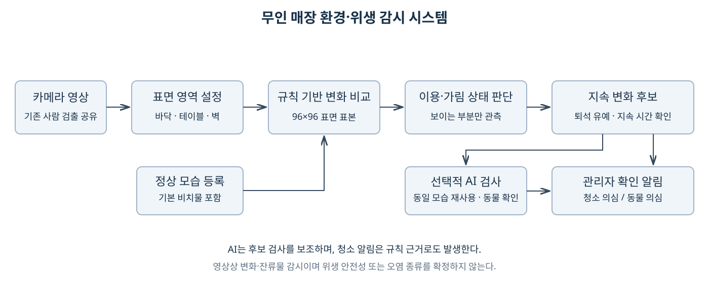

# 무인 매장 환경·위생 관리를 위한 표면 변화 기반 영상 감시 시스템의 구현 및 예비 평가

## 초록

무인 매장의 환경·위생 관리를 지원하려면 영상에 존재하는 물체뿐 아니라 정상 비치물, 이용자의 활동 및 가림을 고려하여 청소가 필요한 상황을 구분해야 한다. 본 연구에서는 바닥·테이블·벽의 지정 영역을 대상으로 규칙 기반 변화 감지와 선택적 AI 검사를 결합한 영상 감시 시스템을 구현하였다. 정상 비치물을 포함한 기준 모습과 현재 영상을 비교하고, 테이블 이용 중에는 일반 청소 알림을 보류하며 퇴석 후 잔류 여부를 확인한다. 사무실의 동일 테이블에서 촬영한 개발 영상 21개에 대해 18개 파라미터 조합을 탐색한 결과, 선정 조합은 TP 6, FP 2, TN 9, FN 4와 F1 66.7%를 기록하였다. 또한 정적 합성 입력에서 동일 후보의 AI 검사 결과를 재사용했을 때 후보 검사 요청이 9회에서 1회로 감소하였다. 두 결과는 각각 동일 개발 자료의 튜닝 점수와 스케줄링 동작의 예비 검증이며, 독립 환경의 일반화 성능이나 실제 자원 절감률을 의미하지 않는다.

**주제어:** 무인 매장, 환경·위생 감시, 표면 변화 감지, 가림 처리, 선택적 AI 검사

## 1. 서론 (Introduction)

상주 관리자가 없는 매장에서는 바닥의 잔류물이나 이용 후 테이블에 남겨진 물건을 지속적으로 확인하기 어렵다. 영상에서 컵이나 용기를 검출하더라도 해당 물건이 정상 비치물인지, 이용 중인 물건인지, 이용자가 떠난 뒤 남긴 잔류물인지는 추가적인 판단이 필요하다. 또한 사람이 표면을 가린 상황을 청결한 상태로 해석하면 기존 오염 의심 상황을 잘못 해제할 수 있다.

관련 연구에서 Luna 등은 방치물 검출을 전경·정지 물체 검출, 사람 검출 및 방치 여부 검증으로 구성하고, 영상 조건과 단계별 오류가 전체 성능에 미치는 영향을 비교하였다[1]. Smeureanu와 Ionescu는 배경 차분·움직임 추정으로 정지 후보를 찾은 뒤 CNN 캐스케이드로 방치 수하물을 판단하였다[2]. 영상 처리 비용 측면에서 NoScope는 프레임 차이 검출기와 특화 모델을 결합하여 참조 신경망의 반복 실행을 줄였다[3]. 본 연구는 이들 방법의 우월한 대체를 주장하기보다, 표면별 정상 비치물과 이용·가림 상태를 무인 매장의 청소 확인 정책으로 통합하는 시스템 구현에 초점을 둔다.

최적화 관련 연구로 DeepCache는 연속 영상의 시간적 유사성을 이용하여 모델 내부 계산 결과를 재사용하였고[4], FrameExit는 영상의 난이도에 따라 처리할 프레임 수를 조절하는 조건부 조기 종료를 제안하였다[5]. 본 시스템은 신경망 내부를 변경하지 않는 후보 수준 검사 결과 재사용을 사용한다. 쓰레기 영상 자료인 TACO[6]와 변화 검출 벤치마크인 CDnet 2014[7]는 보조 평가에 참고할 수 있으나, 정적 이미지나 전경 마스크만으로 이용·퇴석에 따른 청소 알림 성능을 검증할 수는 없다. 따라서 실물 배치와 이용자 행동을 포함하는 자체 영상 평가가 필요하다.

본 연구의 목적은 이러한 운영 상황을 고려하여 관리자의 청소 확인을 지원하는 영상 감시 시스템을 구현하는 것이다. 사용자가 지정한 표면별 기준 모습, 사람의 이용 상태 및 가림 정보를 결합하여 확인이 필요한 변화를 알리고, 동일 후보에 대한 반복 AI 검사를 줄인다. 본 논문에서 환경·위생 감지는 영상에서 관측되는 표면 변화와 잔류물 의심 상황을 의미하며, 미생물 측정이나 위생 안전성 판정을 포함하지 않는다. 실제 촬영한 개발 영상으로 표면 변화 감지 파라미터를 예비 평가하고, 합성 입력으로 검사 결과 재사용 정책의 동작을 확인한다.

## 2. 연구 방법 (Methods)

### 2.1 시스템 구성과 표면 변화 감지

시스템은 표면 설정 및 기준 등록, 규칙 기반 변화 감지, 이용·가림 판단, 선택적 AI 검사, 관리자 대시보드로 구성된다(그림 1). 사용자는 바닥·테이블·벽의 다각형 관심 영역을 지정한다. 컵·모니터 등 기본 비치물은 평소 위치에 둔 채 깨끗한 모습을 등록하며, 유효한 관측 5회의 평균 영상을 기준으로 저장한다. 고정된 비치물은 물건별 종류나 경계를 지정하지 않아도 기준 모습에 포함된다.

각 표면은 96×96 RGB 표본으로 변환하여 기준 영상과 비교한다. 제한적인 밝기 보정 후 색상 차이가 임계값을 초과하는 표본을 연결 성분으로 묶어 변화 후보를 생성한다. 후보의 공간적 연속성과 지속 시간을 확인하여 일시적 변화와 구분한다. 테이블·바닥은 최소 0.5초, 벽은 최소 2초 간격으로 관측한다. 사람 검출·추적은 기존 모델과 결과를 공유하되, 이용 상태의 최신성을 확보하도록 검출 주기를 보완한다.

그림 1. 표면별 기준 비교와 이용·가림 판단을 결합한 감시 구조. AI는 후보 검사와 동물 확인을 보조하며, 청소 확인 알림은 규칙 근거로도 발생한다.

### 2.2 이용 및 가림을 고려한 알림 정책

테이블의 이용 여부는 사용자가 지정한 좌석·이용 영역과 사람의 위치를 이용하여 판단한다. 이용 중에는 일반 청소 알림을 보류하고, 사람이 떠난 뒤 퇴석 유예와 잔류 확인 시간을 거쳐 알림을 발생시킨다. 기본 설정은 각각 45초와 15초이다. 바닥·벽은 테이블의 이용 중 보류 정책과 구분하여 변화 지속성을 확인한다.

사람 검출 사각형 주변과 겹치는 표본은 비교에서 제외하고, 보이는 부분은 계속 검사한다. 영역의 30%를 초과하여 가려지면 가림 상태로 표시한다. 기존 알림 후보가 가려져 관측되지 않더라도 이를 청소 완료로 처리하지 않으며, 다시 보이는 상태에서 변화 해소를 확인한다. 동물 의심 후보는 일반 청소 알림 보류와 별도로 반복 확인한다.

### 2.3 선택적 AI 검사와 결과 재사용

변화 후보의 잘라낸 영상을 물체 검출 모델에 전달하며, 전체 영역의 AI 요청은 초당 최대 1회로 제한한다. 동일 후보의 성공한 결과는 현재 모습이 유사할 때 최대 60초간 재사용한다. 재사용 조건은 이전 경계 상자와의 IoU 0.8 이상, 8×8 RGB 특징의 평균 절대 차이 8 이하, 채널 차이가 24를 초과하는 항목의 비율 10% 이하이다. 또한 현재 후보가 가리지 않은 유효한 관측이어야 한다.

위치·모습이 달라지거나 유효기간이 지나면 재검사하며, 테이블 이용 중 검사한 후보는 퇴석 확정 후 한 번 다시 확인한다. 새 후보의 최초 검사, 동물 의심의 추가 확인 및 주기적인 전체 표면 검사는 유지한다. 실패하거나 지연된 결과는 재사용하지 않는다. 대시보드는 관측 가능한 정상 상태, 청소 확인 필요, 이용 중 및 가림 상태를 구분하여 표시한다.

### 2.4 실영상 개발 평가와 파라미터 탐색

사무실에서 가장 크게 보이는 동일한 흰색 테이블을 대상으로 주 실험자 1명이 행동한 영상을 사용하였다. 촬영한 23개 중 잔류물 판단 또는 초기 물체 상태가 불명확한 2개를 제외하여 잔류물 있음 10개와 없음 11개, 총 21개를 개발 평가에 포함하였다. 원본 VP8 WebM 1280×720 영상을 2 Hz RGB 프레임으로 변환하고, 사람 모델 `yolo11n-pose-416x224.onnx`와 물체 모델 `yolo11n_tier2_fp32.onnx`, 실제 표면 감지 코드를 Windows CPU 환경의 ONNX Runtime 1.26.0에서 추론 스레드 1개로 실행하였다. 각 영상은 독립된 상태에서 시작하고 영상 15초 이후 가림 없는 5회 관측으로 기준 모습을 구성하였다.

평가는 영상마다 관찰 후반의 육안 판정 체크포인트 하나를 정하고, 가장 가까운 2 Hz 예측과 잔류물 유무를 비교하였다. `threshold` ∈ {16, 24, 32}, `min_area` ∈ {0.001, 0.003}, `confirm_seconds` ∈ {5, 10, 15}의 18개 조합을 비교하되 ROI, 이용 구역, 모델, 퇴석 유예 및 나머지 정책은 고정하였다. 21개 영상을 모두 처리하고 FP가 초기 2건 이하이며 품질 유효 비율이 95% 이상인 조합 중 F1이 가장 높은 값을 선정하였다. 동점이면 FP, 품질 유효 비율, 고정 후보 ID 순으로 결정하였다. 이 절차는 동일 영상을 사용한 파라미터 선택이므로 선정 결과를 독립 테스트 성능으로 해석하지 않았다.

### 2.5 합성 입력 기반 AI 재사용 시험

Windows 환경의 MSVC Release 빌드에서 합성 RGB 입력으로 검사 요청 정책을 비교하였다. 입력 크기는 100×100이며, 배경값 80의 영상에 4초부터 동일 위치의 값 180인 사각형을 유지하였다. 시뮬레이션 시각 1초부터 50초까지 0.5초 간격으로 관측하여 결과 재사용 비활성 조건과 활성 조건에 동일 입력을 제공하였다. AI 응답은 성공하되 동물을 반환하지 않는 테스트 대역으로 대체하였다. 따라서 측정 대상은 실제 모델의 추론 시간이나 검출 정확도가 아니라 후보 검사 요청 수 및 알림 발생 여부이다.

비교 시 알림 규칙은 동일하게 유지하고, 합성 시험에서는 이용 확인 1초, 퇴석 유예 2초, 잔류 확인 2초, 해소 확인 2초를 사용하였다. 이는 앞서 설명한 운영 기본값과 구분되는 시험 설정이다. 평가 구간은 전체 표면 검사 주기인 60초보다 짧아 해당 요청이 발생하지 않았다. 별도의 회귀 시험에서는 모습 변경, 가림, 퇴석, 캐시 만료, AI 실패·지연 및 동물 추가 확인을 검증하였다.

## 3. 결과 (Results)

표 1은 초기 설정과 선정 설정의 개발 체크포인트 결과이다. 제약을 만족한 조합은 초기 조합과 선정 조합 두 개였으며, 선정값은 `threshold=32`, `min_area=0.003`, `confirm_seconds=15초`였다. 선정 조합에서 FP는 2건으로 유지되었고, 재현율은 50.0%에서 60.0%, F1은 58.8%에서 66.7%로 증가하였다. 실제로 체크포인트 판정이 바뀐 영상은 FN에서 TP가 된 한 건이었다. 품질 유효 비율은 두 조건을 포함한 모든 조합에서 20/21(95.2%)이었으며, 품질이 유효하지 않았던 한 영상도 알림 전달 평가에서는 FN으로 포함하였다.

| 항목 | 초기 설정 | 선정 설정 |
|---|---:|---:|
| `threshold / min_area / confirm_seconds` | 24 / 0.003 / 15초 | 32 / 0.003 / 15초 |
| TP / FP / TN / FN | 5 / 2 / 9 / 5 | 6 / 2 / 9 / 4 |
| 정밀도 | 71.4% | 75.0% |
| 재현율 | 50.0% | 60.0% |
| F1 | 58.8% | 66.7% |
| 정확도 | 66.7% | 71.4% |

표 1. 동일한 21개 개발 영상에서의 초기 설정과 선정 설정 비교. 선정 설정의 수치는 독립 테스트 결과가 아니다.

선정 설정에서도 잔류물 없음 영상의 오탐 2건과 잔류물 있음 영상의 미검출 4건이 남았다. 또한 체크포인트에서는 TN이지만 영상 후반에 추가 알림이 관찰된 사례가 있어, 단일 체크포인트 점수가 전체 사건 단위 성능을 나타내지는 않았다.

합성 입력의 보조 시험에서는 주기 검사 조건의 후보 AI 요청이 9회, 결과 재사용 조건이 1회로 88.9% 감소하였고 두 조건 모두 청소 확인 알림이 발생하였다. 회귀 시험에서는 동일 경계 내 모습 변경 시 재검사, 가림 중 기존 알림 유지, 실패·지연 결과의 재사용 방지, 유효기간 만료 및 퇴석 후 재확인을 검증하였다. 이 결과는 테스트 대역을 이용한 요청 스케줄링 검증이며 실제 모델의 추론 시간, CPU 또는 전력 절감률은 측정하지 않았다.

## 4. 논의 (Discussion)

본 시스템은 물체의 존재 여부만으로 청소 필요성을 판단하지 않고, 표면별 정상 배치와 이용 상황을 함께 고려한다. 이 구조는 평소 비치물의 일괄 기준 등록, 이용 중 일반 알림 보류, 가림 상태의 판정 유보를 일관된 관리 흐름으로 연결한다. 개발 평가에서는 변화 임계값을 높인 선정 조합이 FP를 늘리지 않으면서 한 건의 FN을 줄였지만, 이는 21개 제한 후보에서 관찰된 결과이며 모든 환경에 적용되는 기본값이나 통계적으로 확립된 개선으로 볼 수 없다. 합성 결과 역시 정적인 후보에서 반복 AI 요청을 억제할 가능성을 보였을 뿐 시스템 전체의 자원 절감을 입증하지는 않는다.

현재 평가와 방법에는 다음 한계가 있다. 첫째, 평가 자료가 실제 무인 매장이 아닌 단일 사무실, 동일 테이블, 단일 촬영 세션과 주 실험자 1명에 한정되었다. 둘째, 같은 21개 영상에서 파라미터를 선택하고 점수를 제시했으므로 일반화 성능을 추정할 독립 시험군이 없다. 셋째, 영상별 후반 체크포인트 하나만 평가하여 사용 중 오탐, 늦은 추가 오탐, 정확한 알림 지연과 제거 후 해소를 모두 반영하지 못했다. 넷째, 기준 모습과의 차이를 이용하므로 정상 물건의 이동이나 조명 변화가 오염 의심 변화와 혼동될 수 있고, 축소 표본과 사각형 기반 가림 처리는 작은 잔류물을 놓치거나 실제보다 넓은 영역을 제외할 수 있다. 다섯째, 영상 특징 재사용은 의미적 동일성을 보장하지 않으며 토사물·배설물 등 오염의 세부 종류는 현재 분류하지 않는다.

후속 평가에서는 선정 파라미터를 고정한 별도 촬영 세션에서 정상 비치물, 퇴석 후 잔류물, 가림 중 물체 추가 및 동일 위치 물체 교체 장면을 수집해야 한다. 사건별 정밀도·재현율, 시간당 오탐, 판정 가능 시점 이후의 알림 지연과 제거 후 해소 지연을 측정하고, 동일 영상의 AI 재사용 활성·비활성 조건에서 실제 요청 수와 추론 시간을 비교할 필요가 있다. 본 연구는 무인 매장의 환경·위생 확인을 지원하는 시스템의 구현 및 예비 검증 단계이며, 독립 실환경 평가를 통해 운영상의 유효성을 확인해야 한다.

## 참고문헌

[1] E. Luna, J. C. San Miguel, D. Ortego, and J. M. Martínez, “Abandoned Object Detection in Video-Surveillance: Survey and Comparison,” *Sensors*, vol. 18, no. 12, article 4290, 2018. [원문 및 DOI](https://www.mdpi.com/1424-8220/18/12/4290).

[2] S. Smeureanu and R. T. Ionescu, “Real-Time Deep Learning Method for Abandoned Luggage Detection in Video,” *arXiv:1803.01160*, 2018 (EUSIPCO 2018 채택본). [저자 공개본](https://arxiv.org/abs/1803.01160).

[3] D. Kang, J. Emmons, F. Abuzaid, P. Bailis, and M. Zaharia, “NoScope: Optimizing Neural Network Queries over Video at Scale,” *Proceedings of the VLDB Endowment*, vol. 10, no. 11, pp. 1586–1597, 2017. [학회 공개 원문](https://www.vldb.org/pvldb/vol10/p1586-kang.pdf).

[4] M. Xu, M. Zhu, Y. Liu, F. X. Lin, and X. Liu, “DeepCache: Principled Cache for Mobile Deep Vision,” *Proceedings of the 24th Annual International Conference on Mobile Computing and Networking (MobiCom)*, 2018, doi: 10.1145/3241539.3241563. [저자 공개 원문](https://xumengwei.github.io/files/MobiCom18-DeepCache.pdf).

[5] A. Ghodrati, B. E. Bejnordi, and A. Habibian, “FrameExit: Conditional Early Exiting for Efficient Video Recognition,” *Proceedings of the IEEE/CVF Conference on Computer Vision and Pattern Recognition (CVPR)*, pp. 15608–15618, 2021. [학회 공개 원문](https://openaccess.thecvf.com/content/CVPR2021/html/Ghodrati_FrameExit_Conditional_Early_Exiting_for_Efficient_Video_Recognition_CVPR_2021_paper.html).

[6] P. F. Proença and P. Simões, “TACO: Trash Annotations in Context for Litter Detection,” *arXiv:2003.06975*, 2020. [저자 공개본](https://arxiv.org/abs/2003.06975).

[7] Y. Wang, P.-M. Jodoin, F. Porikli, J. Konrad, Y. Benezeth, and P. Ishwar, “CDnet 2014: An Expanded Change Detection Benchmark Dataset,” *Proceedings of the IEEE Conference on Computer Vision and Pattern Recognition Workshops*, pp. 387–394, 2014. [학회 공개 원문](https://openaccess.thecvf.com/content_cvpr_workshops_2014/W12/html/Wang_CDnet_2014_An_2014_CVPR_paper.html).
